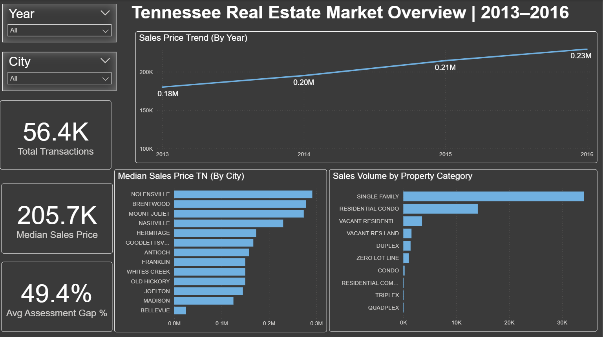
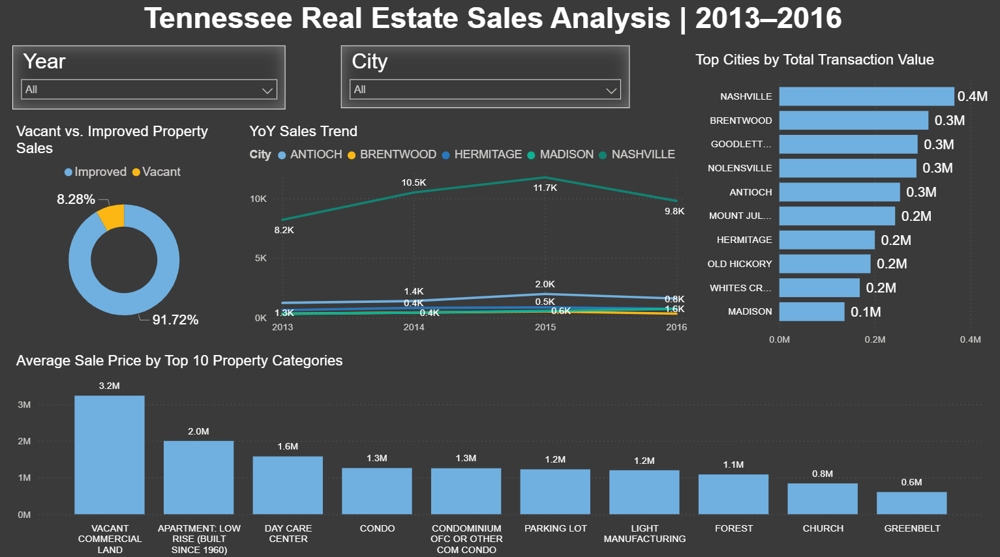

# Tennessee Real Estate Market Analysis

An end-to-end data analytics project cleaning 56,000+ raw property records using SQL and delivering an interactive Power BI dashboard with actionable insights into market trends, city-level pricing, and property type performance across Tennessee (2013–2016).

**Tools used:** Microsoft SQL Server (SQL) · Power BI

## Data Source
Tennessee property sales records (2013–2016) covering 56,374 transactions across cities, property types, and sale values.

---

## About This Project

End-to-end solo project covering SQL data cleaning, data modelling, DAX measure development, and dashboard design in Power BI. The project was executed in two phases — a structured SQL cleaning pipeline resolving six categories of data quality issues, followed by a two-page interactive dashboard enabling stakeholders to explore market trends, pricing gaps, and city-level performance.

---

## Business Problem

Tennessee's real estate market data existed in raw, inconsistent form — with missing property addresses, combined address fields, inconsistent date formats, duplicate records, and unstandardized values. Stakeholders including real estate agents, investors, and county assessors could not make informed decisions without reliable, structured data to analyze sales trends, pricing patterns, and market distribution across cities and property types.

The goal was to transform 56,374 raw property records into a clean, analysis-ready dataset and deliver an interactive Power BI dashboard enabling data-driven insights across Tennessee's real estate market from 2013 to 2016.

---

## Approach

The analysis was structured across two phases:

- **Phase 1 — Data Cleaning (SQL)** — a structured pipeline in Microsoft SQL Server resolved six categories of data quality issues: inconsistent date formats converted using `CONVERT`; missing property addresses imputed via self-join on `ParcelID`; combined address fields split into Street and City using `PARSENAME`; `SoldAsVacant` field standardized from binary (0/1) to readable (Y/N) using `CASE` statements; 103 duplicate records identified and removed using `RANK()` window function; and redundant columns dropped using `ALTER` and `DROP`
- **Phase 2 — Reporting (Power BI)** — an interactive two-page dashboard was built on the cleaned dataset with a calendar table for time-based trend analysis and DAX measures covering Median Sale Price, Total Transactions, Average Assessment Gap %, and YoY Sales Growth. Year and City slicers enable dynamic cross-filtering across both pages

---

## Dashboard Preview

**Page 1 — Market Overview**

> KPI cards for total transactions and median price · Sales price trend by year · Median price by city · Sales volume by property category
 

**Page 2 — Sales Analysis**

> YoY sales trend by city · Vacant vs improved property split · Top cities by transaction value · Average price by property category

---

## Key Findings

- **Nashville dominated with 40,216 transactions (71% of total market)** — followed by Antioch (6,286) and Hermitage (3,126), revealing clear market concentration for investment targeting
- **Median sale price of $205,700** established as the market benchmark — enabling price comparison across cities and property types
- **Sales volume grew 48% from 2013 to 2015** (11,292 to 16,734 transactions) — peak market activity identified for trend and forecasting analysis
- **Single Family homes account for 60.5% of all transactions** (34,120 records) — the dominant property category driving market activity
- **Assessment gap monitoring** enabled stakeholders to identify properties where assessed value diverged from sale price — supporting pricing and investment decisions
- **103 duplicate records removed** and all missing address data resolved — delivering a fully clean, analysis-ready dataset

---

## Repository Contents

| File | Description |
|---|---|
| `TN_Real_Estate_EDA.sql` | Full SQL script covering all 6 data cleaning steps |
| `Final Output - TN_Real_Estate_Data_cleaned.xlsx` | Cleaned dataset output (56,374 records) |
| `TN Real Estate.pbix` | Interactive Power BI dashboard file |
| `Project Summary - TN Real Estate Market and Sales.pptx` | Project presentation with SQL walkthrough and Power BI dashboard |

---

## Connect

[LinkedIn](http://www.linkedin.com/in/shobhitasohal)
